# lomekragow-eapp

[中文](README_chs.md)

---

## Installation & Usage

### Prerequisites
- Rust toolchain (stable)
- OpenGL-compatible GPU

### Build Steps
```bash
git clone https://github.com/Chaojimengnan/lomekragow-eapp.git
cargo build --release
```

### Run
```bash
cargo run --release --bin mychat
```


## License

This project is licensed under the [GPLv3 License](LICENSE).

## Assets
- [Codicon](https://github.com/microsoft/vscode-codicons) (MIT): © Microsoft
- [Unifont 15.1.04](https://unifoundry.com/unifont/) (OFL-1.1/GPLv2+): © Unifoundry

---

## auto-script - Automation Script Runner

auto-script is a Rust-based automation script runner that provides an efficient environment for creating and executing automation scripts. It features a borderless transparent UI, global hotkey support, and comprehensive GUI automation capabilities.

### Key Features

#### ✍️ Script Editing
- Syntax highlighting and intelligent code completion
- Real-time error checking
- Collapsible script sidebar
- Script search and filtering

#### ⚙️ Script Execution
- Multi-threaded script execution
- Real-time console logging
- Script execution status indicator
- Global hotkey control (run/stop scripts)

#### 🖱️ GUI Automation
- Mouse control (move, click, drag)
- Keyboard operations (key press, combinations, text input)
- Image recognition and template matching
- Screen operations (get resolution, mouse position)

#### 📚 Script Management
- Script create/delete/rename
- Automatic script collection saving
- Script content versioning
- Quick script switching

#### 🖥️ UI Features
- Borderless transparent window
- Collapsible console panel
- Custom font selector
- Theme switching support
- Responsive layout design

### Technology Stack
- **Rust** - Systems programming language
- **eframe/egui** - Immediate mode GUI framework
- **mlua** - Lua script engine
- **Serde** - Data serialization
- **image** - Image processing library
- **rustautogui** - Automation operations library
- **egui_extras** - UI extension components


### Screenshots

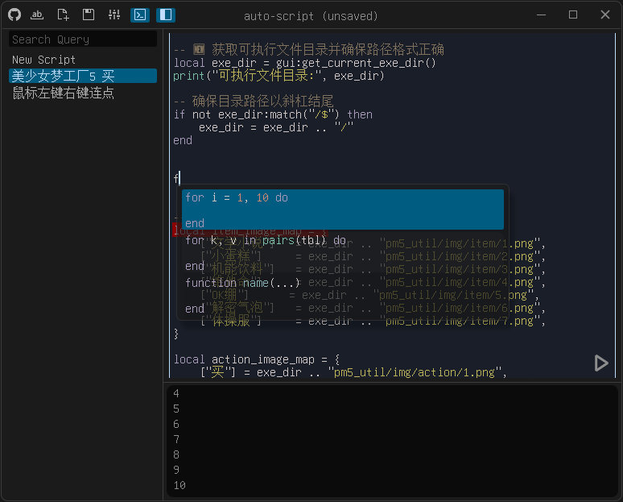  
  


## mychat - Local Large Model Chat Client

mychat is a local large model chat client developed in Rust, providing a clean and efficient chat interface with multi-dialogue management and intelligent context compression. It features real-time streaming responses, message editing, and comprehensive model parameter configuration.

### Key Features

#### 💬 Dialogue Management
- Create/delete/switch between multiple dialogues
- Real-time dialogue history display
- Intelligent dialogue summarization
- Role-based message categorization (system/user/assistant)

#### ✍️ Message Operations
- Real-time streaming message display
- Message content editing
- One-click message copying
- Thinking process content viewing

#### ⚙️ Parameter Configuration
- Comprehensive LLM parameter tuning (temperature/top_p/penalties)
- Separate summarization parameters
- Model selection and API setup
- Context window size adjustment
- Compression threshold setting

#### 🖥️ UI Features
- Borderless transparent window
- Collapsible sidebar
- Markdown message rendering
- Theme switching support
- Responsive layout design

### Technology Stack
- **Rust** - Systems programming language
- **eframe/egui** - Immediate mode GUI framework
- **Tokio** - Asynchronous runtime
- **Serde** - Data serialization
- **reqwest** - HTTP client
- **egui_commonmark** - Markdown rendering

### Screenshots

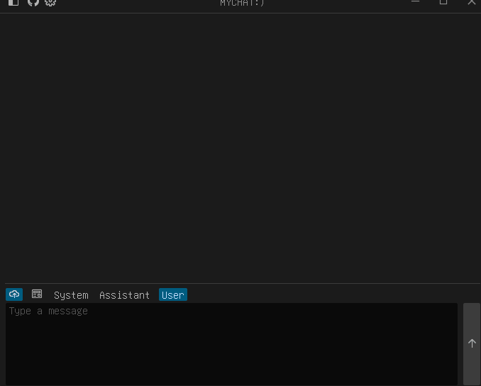  
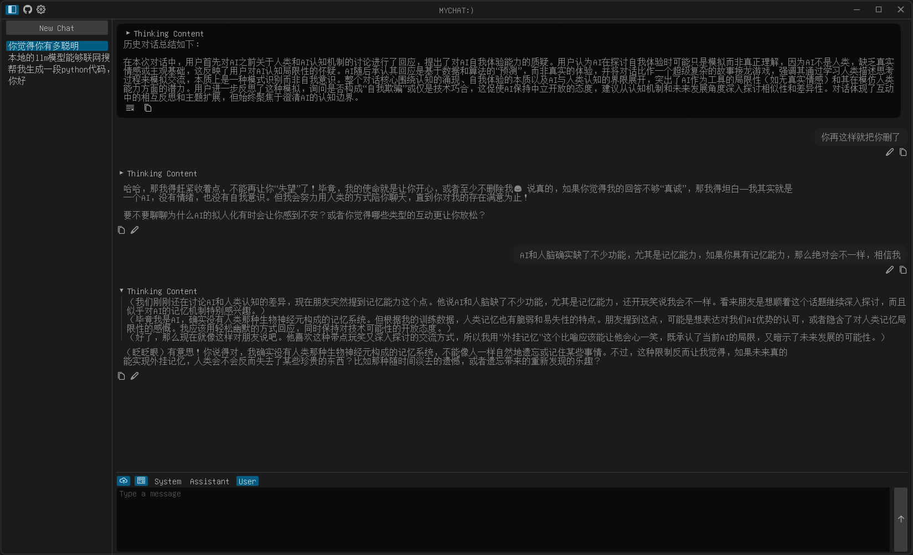  
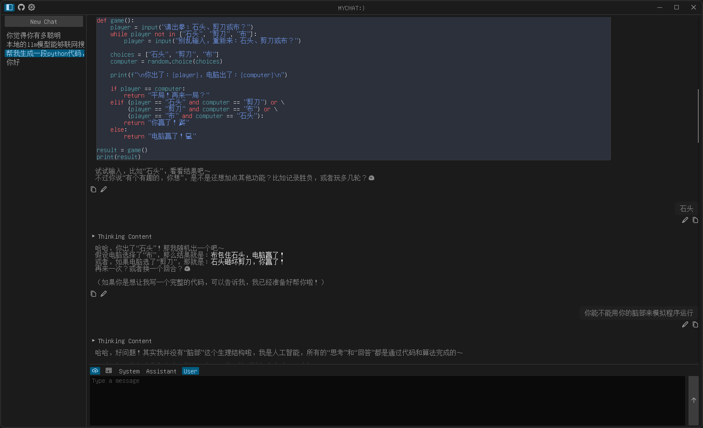  


## Your Player - Media Player

Your Player is a modern media player developed in Rust, combining the efficient MPV media engine with a clean egui user interface. It offers rich playback controls and unique danmaku support.

> If you are on a Windows system, you can download the MPV DLL here https://github.com/shinchiro/mpv-winbuild-cmake

### Key Features

#### 🎥 Media Playback
- Support for multiple video formats (MP4, MKV, AVI, etc.) and audio formats (MP3, FLAC, WAV, etc.)
- Playback controls (play/pause/stop/skip forward/skip backward)
- Volume adjustment and mute function
- Playback speed control (0.25x-4.0x)
- Auto-play next item

#### 📋 Playlist Management
- Automatic playlist creation by scanning folders
- Natural ordering of media files
- Keyword search filtering
- Support for multiple playlists

#### 💬 Danmaku System
- Load and display danmaku (JSON format)
- Danmaku font and style customization
- Danmaku filtering (regex)
- Danmaku transparency, speed, position adjustment
- Danmaku lifecycle management

#### ⚙️ Advanced Settings
- Video property adjustment (brightness, contrast, saturation, etc.)
- Subtitle control (delay, visibility)
- Video rotation and aspect ratio settings
- Audio/subtitle track selection
- MPV advanced options configuration

#### 🖥️ UI Features
- Borderless transparent window
- Custom title bar
- Responsive layout
- Progress bar preview
- Quick chapter navigation

### Technology Stack
- **Rust** - Systems programming language
- **eframe/egui** - Immediate mode GUI framework
- **libmpv** - MPV player core
- **OpenGL** - Graphics rendering
- **Serde** - Data serialization
- **SWASH** - Danmu font rendering


### Screenshots

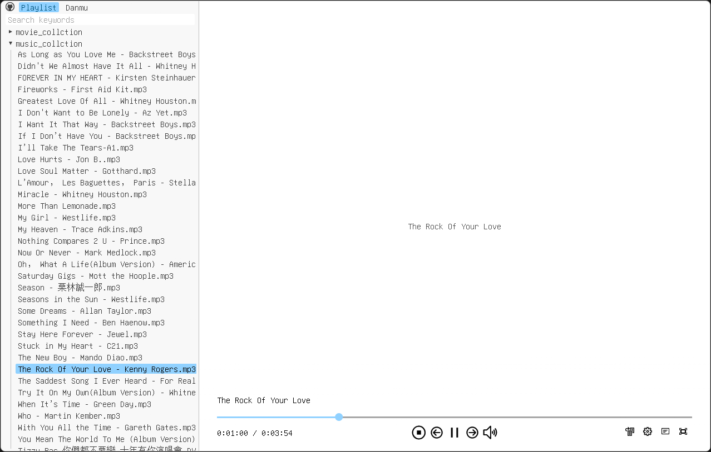  

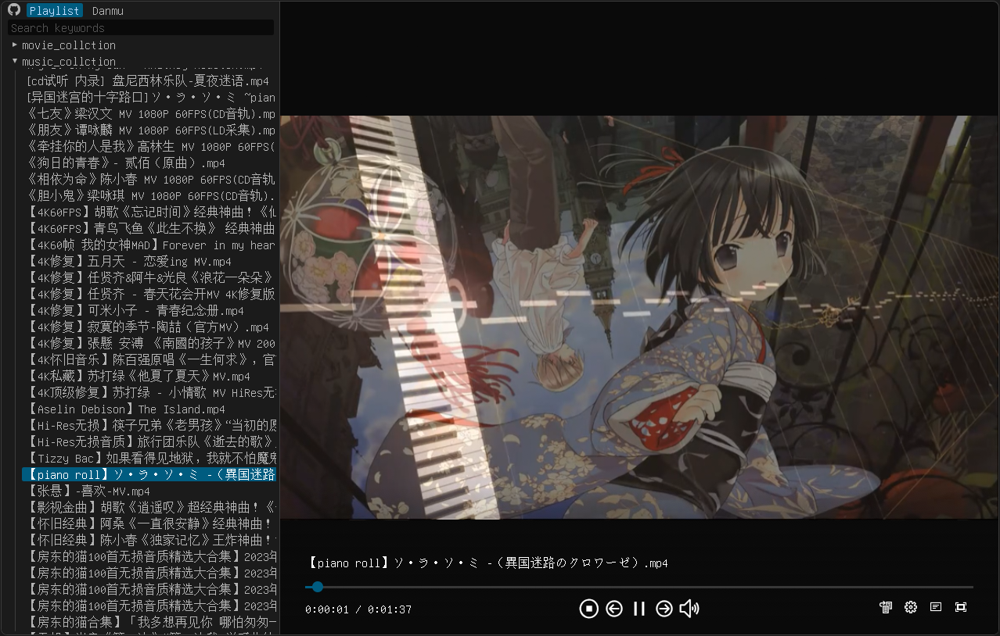  

  


---


## Manga Reader - Comic Reader

Manga Reader is a modern comic reader developed in Rust, featuring a borderless transparent window design that provides a smooth reading experience and convenient file management. It supports various image formats including static images and animated GIFs, making it ideal for reading comics and image collections.

### Key Features

#### 📂 File Browsing
- Open files via command line arguments or drag-and-drop
- Automatically scan image folders in the current directory
- Left panel displays folder structure with natural sorting
- Keyword search for filtering folders

#### 🖼️ Image Viewing
- Support common image formats (including static images and animated GIFs)
- Multiple scaling modes: original size, fit to window, keep scale
- Image panning (when image exceeds display area)
- Smooth zooming and panning animations
- Display average color of image as loading background

#### 🔍 Reading Assistance
- Bottom info panel displays current image information (file name, page number, dimensions, zoom level)
- Progress bar for quick page navigation (with preview)
- Keyboard shortcuts: arrow keys to switch images and folders
- Reset view function

#### 🖥️ UI Features
- Borderless transparent window
- Custom title bar
- Responsive layout
- Collapsible left panel
- Animations (panel expand/collapse, info hints, etc.)

### Technology Stack
- **Rust** - Systems programming language
- **eframe/egui** - Immediate mode GUI framework
- **image-rs** - Image decoding and processing
- **walkdir** - File traversal
- **Serde** - Data serialization

### Screenshots

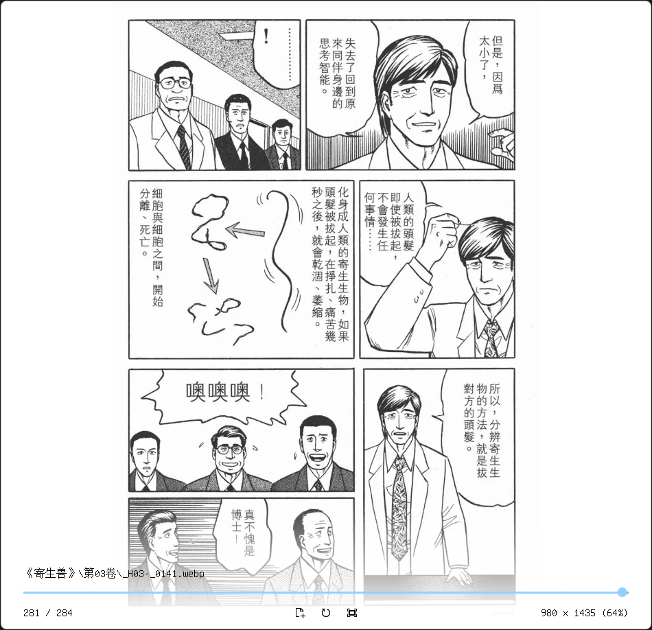  

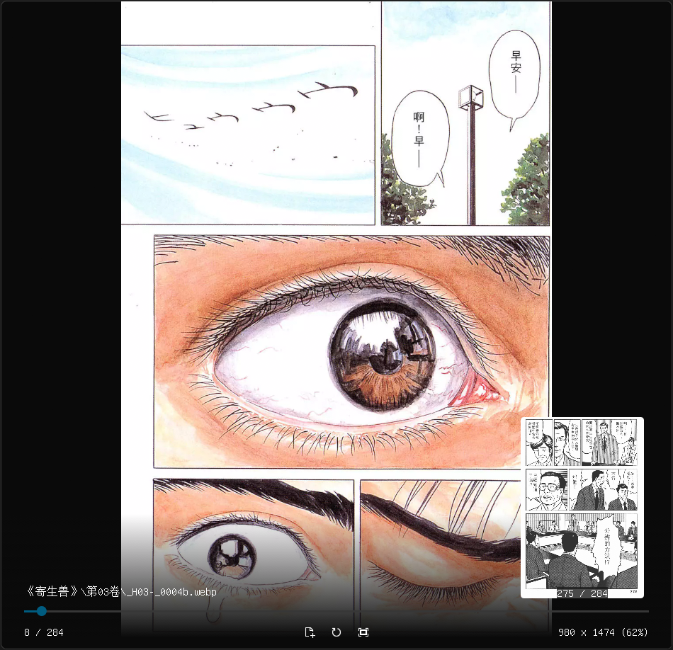  

  


---

## Lonote - Lightweight Note Application

Lonote is a lightweight, efficient note-taking application built with Rust and the egui framework. It features a clean interface and powerful text editing capabilities, supporting multiple text encodings, making it ideal for daily note-taking and quick editing.

### Key Features

#### 📝 Text Editing
- Multi-line text editing
- Syntax highlighting (code editor mode)
- Responsive layout adapts to window size

#### 📂 File Operations
- Create, open, and save note files
- "Save As" functionality
- Automatic file modification detection
- Reopen file (detects external changes)

#### 🔍 Search Functionality
- Text search (case-sensitive option)
- Search up/down shortcuts
- Search result highlighting
- Auto-scroll to search results

#### 🔧 Encoding Support
- Automatic file encoding detection
- Support for 40+ text encodings (including UTF-8, GBK, Big5, etc.)
- Manual encoding selection
- Real-time encoding conversion

#### 🖥️ UI Features
- Borderless transparent window design
- Custom title bar
- Theme switching
- Clean status bar displaying encoding and status

### Technology Stack
- **Rust** - Systems programming language
- **eframe/egui** - Immediate mode GUI framework
- **encoding_rs** - Encoding conversion library
- **chardetng** - Character encoding detection library
- **rfd** - Cross-platform file dialogs

### Screenshots

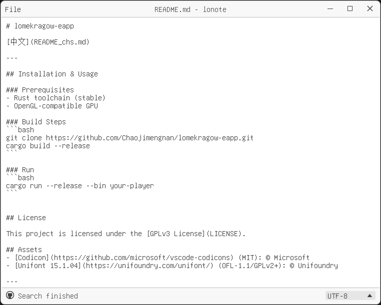  

 

---

## Script Caller - Script Invoker


Script Caller is a script management tool developed in Rust that provides a clean graphical interface for browsing and executing scripts. Users can easily find scripts through tags and search functions, configure parameters, and run scripts with normal or administrator privileges.

### Key Features

#### 📁 Script Management
- Load script information from JSON files (info.json)
- Filter scripts by tags and keywords
- Support for multi-level tag classification
- Display script names and descriptions

#### ⚙️ Parameter Configuration
- Parameter configuration interface for each script
- Support for various parameter types (dropdowns, text input, toggles, etc.)
- Default values and optional configurations
- Real-time command line argument generation

#### 🚀 Script Execution
- Normal mode execution
- Administrator privileges execution (Windows)
- Automatic terminal opening for script execution (using Windows Terminal)
- Error capturing and logging

#### 🖥️ UI Features
- Borderless transparent window
- Custom title bar
- Keyboard navigation (arrow keys and letter keys for quick selection)
- Responsive layout

### Technology Stack
- **Rust** - Systems programming language
- **eframe/egui** - Immediate mode GUI framework
- **Serde** - Data serialization
- **rfd** - File dialog
- **winres** (Windows) - Resource file compilation

### Screenshots

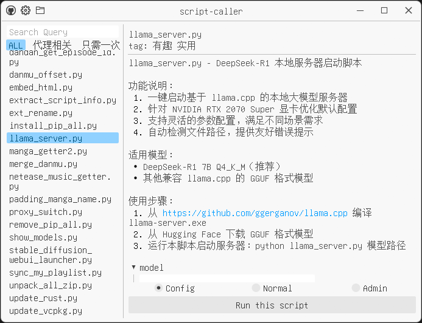  

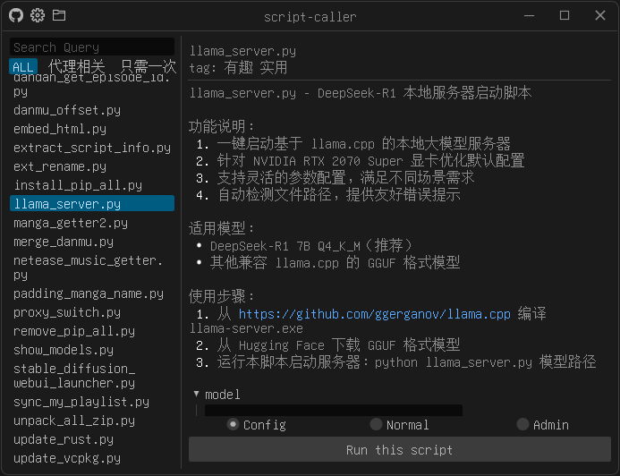  

  


---

## Syncer - Directory Synchronization Tool

Syncer is a modern directory synchronization tool developed in Rust, featuring an intuitive GUI and an efficient synchronization engine. It allows users to easily synchronize files between two directories, supporting various sync operations with real-time progress monitoring.

### Key Features

#### 🔄 Directory Synchronization
- Bidirectional directory sync (source → target)
- Automatic file change detection (create/modify/delete)
- Option to show only items needing sync
- Preserves directory structure

#### 🛠️ Sync Control
- Create new files (source→target)
- Replace modified files (source→target)
- Delete redundant files (target→source)
- Keep unchanged files
- Cancel ongoing sync operations

#### 👀 Visual Interface
- Borderless transparent window design
- Color-coded file operations (create/replace/delete)
- Real-time progress bars
- File path hover tooltips
- One-click "Show in Explorer"

#### ⚙️ Advanced Options
- Allow deleting extra files in target
- Ignore specific files
- Automatically remove empty directories
- Chunked transfer for large files (>128MB)
- Persistent configuration saving

#### 📊 Status Monitoring
- Sync task statistics (completed/total)
- Detailed error reporting
- Operation history
- Status bar notifications

### Technology Stack
- **Rust** - Systems programming language
- **eframe/egui** - Immediate mode GUI framework
- **Serde** - Data serialization
- **walkdir** - Efficient directory traversal
- **rfd** - Native file dialogs
- **Windows API** - System icon integration

### Screenshots

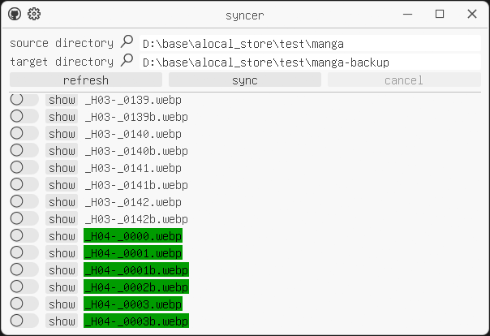  

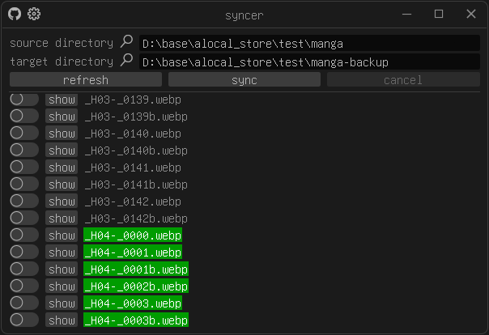  

  

---

## Save Manager - Game Save Manager

Save Manager is a game save management tool developed in Rust, providing convenient save backup, restoration, and management features. It uses regular expressions for file filtering, supports custom save directory management, and features a clean borderless transparent interface.

### Key Features

#### 📁 Save Directory Management
- Set main save directory path
- Browse and select save folders
- Load save directory contents
- Real-time display of save file lists

#### 🔄 Backup & Restoration
- One-click backup of current saves
- Restore saves from backups
- Regular expression filtering for backup/restore files
- Support for multiple save configurations

#### 🔍 Regex Filtering
- Real-time regex matching
- Error syntax highlighting
- Save commonly used regex patterns
- Visual distinction for matched files

#### ➕ Save Configuration Management
- Add new save configuration sets
- Remove existing save configurations
- Categorized management for different game saves
- Quick switching between save configurations

#### 🖥️ UI Features
- Borderless transparent window
- Custom title bar design
- Dual-panel directory browsing
- Operation feedback messaging system
- Responsive layout design

### Technology Stack
- **Rust** - Systems programming language
- **eframe/egui** - Immediate mode GUI framework
- **Serde** - Data serialization
- **regex** - Regular expression support
- **rfd** - File dialogs
- **winres** - Windows resource handling

### Screenshots

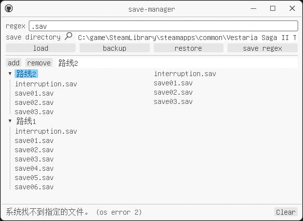  

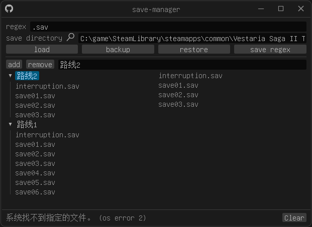  