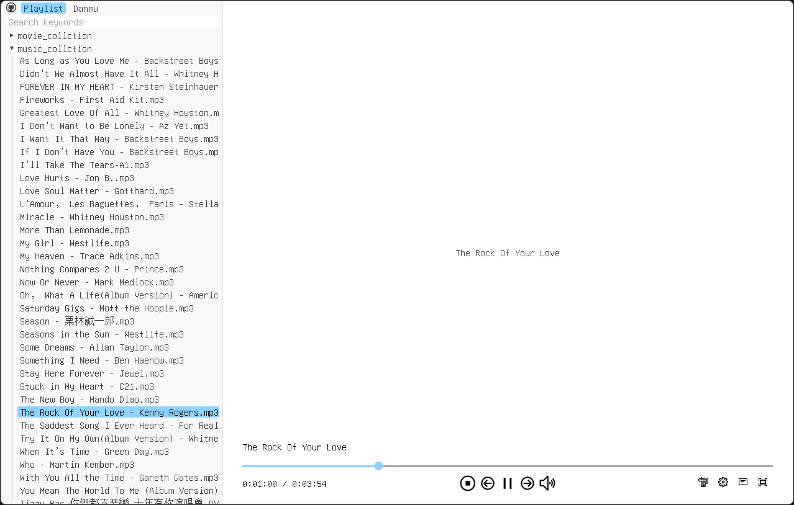
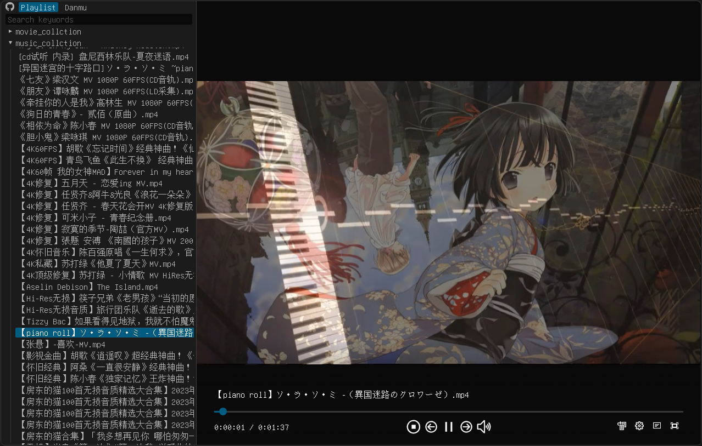
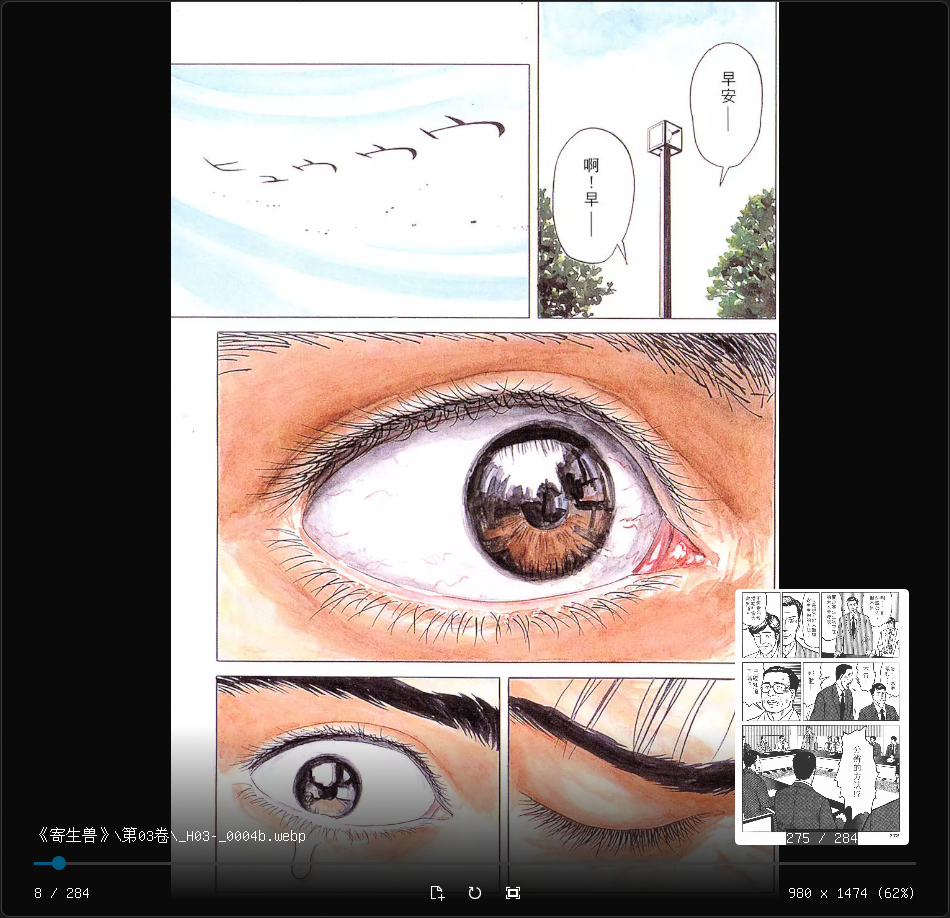
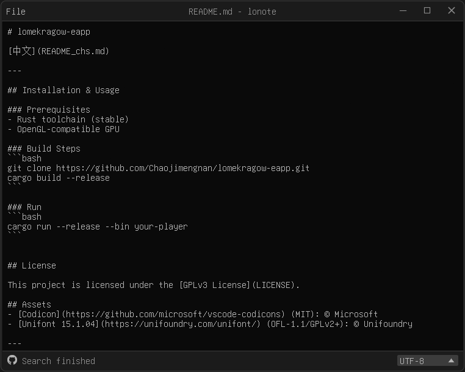
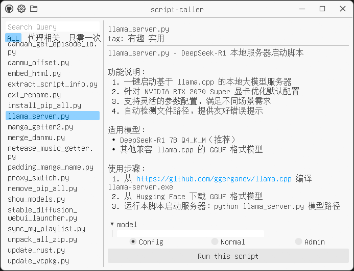
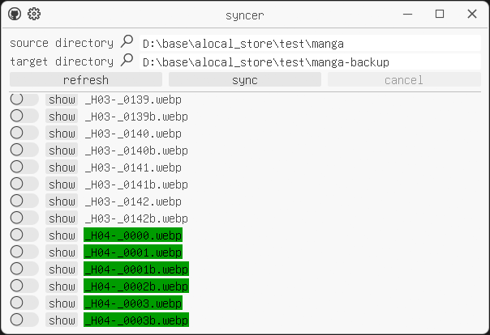

# lomekragow-eapp

[ENGLISE](README.md)

---


## 安装与使用

### 前提条件
- Rust 工具链 (stable)
- OpenGL 兼容显卡

### 构建步骤

```bash
git clone https://github.com/Chaojimengnan/lomekragow-eapp.git
cargo build --release
```

### 运行

```bash
cargo run --release --bin mychat
```

## 许可证

本项目采用 [GPLv3 许可证](LICENSE)。


## 资产
- [Codicon](https://github.com/microsoft/vscode-codicons) (MIT): © Microsoft
- [Unifont 15.1.04](https://unifoundry.com/unifont/) (OFL-1.1/GPLv2+): © Unifoundry

---

## mychat - 本地大模型对话客户端

mychat是一个基于Rust开发的本地大模型对话客户端，提供简洁高效的聊天界面、多轮对话管理和智能上下文压缩功能。它支持实时流式响应、消息编辑和完整的模型参数配置。

### 核心特性

#### 💬 对话管理
- 新建/删除/切换多个对话
- 实时对话历史展示
- 智能对话总结压缩
- 按角色分类消息（系统/用户/助手）

#### ✍️ 消息操作
- 实时流式消息显示
- 消息内容编辑功能
- 一键复制消息内容
- 查看思考过程内容

#### ⚙️ 参数配置
- 完整的LLM参数配置（温度/top_p/惩罚值等）
- 独立的对话总结参数配置
- 模型选择和API设置
- 上下文窗口大小调整
- 压缩阈值设置

#### 🖥️ 界面特性
- 无边框透明窗口设计
- 可折叠的侧边栏
- Markdown消息渲染
- 主题切换支持
- 响应式布局设计

### 技术栈
- **Rust** - 系统级编程语言
- **eframe/egui** - 即时模式GUI框架
- **Tokio** - 异步运行时
- **Serde** - 数据序列化
- **reqwest** - HTTP客户端
- **egui_commonmark** - Markdown渲染


### 截图

  
  
  

## Your Player - 媒体播放器

Your Player 是一个基于 Rust 开发的现代化媒体播放器，结合了高效的 MPV 媒体引擎和简洁的 egui 用户界面。它提供了丰富的播放控制功能和独特的弹幕支持。

> 如果你在Windows系统上，可以在这里下载 MPV 的 DLL https://github.com/shinchiro/mpv-winbuild-cmake

### 功能亮点

#### 🎥 媒体播放
- 支持多种视频格式（MP4、MKV、AVI 等）和音频格式（MP3、FLAC、WAV 等）
- 播放控制（播放/暂停/停止/快进/快退）
- 音量调节和静音功能
- 播放速度控制（0.25x-4.0x）
- 自动播放下一项

#### 📋 播放列表管理
- 文件夹扫描自动创建播放列表
- 自然排序媒体文件
- 关键字搜索过滤
- 支持多个播放列表

#### 💬 弹幕系统
- 加载和显示弹幕（JSON 格式）
- 弹幕字体和样式自定义
- 弹幕过滤（正则表达式）
- 弹幕透明度、速度、位置调节
- 弹幕生命周期管理

#### ⚙️ 高级设置
- 视频属性调节（亮度、对比度、饱和度等）
- 字幕控制（延迟、可见性）
- 视频旋转和宽高比设置
- 音频/字幕轨道选择
- MPV 高级选项配置

#### 🖥️ 界面特性
- 无边框透明窗口
- 自定义标题栏
- 响应式布局
- 进度条预览功能
- 章节快速跳转

### 技术栈
- **Rust** - 系统级编程语言
- **eframe/egui** - 即时模式 GUI 框架
- **libmpv** - MPV 播放器核心
- **OpenGL** - 图形渲染
- **Serde** - 数据序列化
- **SWASH** - 弹幕字体渲染


### 截图

  

  

  

---

## Manga Reader - 漫画阅读器

Manga Reader 是一个基于 Rust 开发的现代化漫画阅读器，采用无边框透明窗口设计，提供流畅的阅读体验和便捷的文件管理功能。支持多种图片格式，包括静态图片和动态 GIF，特别适合阅读漫画和图像集。

### 功能亮点

#### 📂 文件浏览
- 支持从命令行参数或拖拽方式打开文件
- 自动扫描当前目录下的图片文件夹
- 左侧面板展示文件夹结构，支持自然排序
- 关键字搜索过滤文件夹

#### 🖼️ 图片查看
- 支持常见图片格式（包括静态图片和动态 GIF）
- 多种缩放模式：保持原尺寸、适应窗口、保持比例
- 图片平移功能（当图片超出显示区域时）
- 平滑的缩放和平移动画
- 显示图片平均颜色作为加载背景

#### 🔍 阅读辅助
- 底部信息面板显示当前图片信息（文件名、页码、尺寸、缩放比例）
- 进度条快速跳转页面（支持预览）
- 快捷键支持：方向键切换图片和文件夹
- 重置视图功能

#### 🖥️ 界面特性
- 无边框透明窗口
- 自定义标题栏
- 响应式布局
- 左侧面板可折叠
- 动画效果（面板展开/折叠，信息提示等）

### 技术栈
- **Rust** - 系统级编程语言
- **eframe/egui** - 即时模式 GUI 框架
- **image-rs** - 图片解码和处理
- **walkdir** - 文件遍历
- **Serde** - 数据序列化

### 截图

  

  

  


---

## Lonote - 轻量级笔记应用

Lonote 是一款轻量级、高效的笔记应用，基于 Rust 和 egui 框架开发。它提供简洁的界面和强大的文本编辑功能，支持多种文本编码格式，是日常记录和快速编辑的理想工具。

### 功能亮点

#### 📝 文本编辑
- 多行文本编辑功能
- 语法高亮（代码编辑器模式）
- 响应式布局适应不同窗口尺寸

#### 📂 文件操作
- 新建、打开、保存笔记文件
- 支持"另存为"功能
- 文件修改状态自动检测
- 重新打开文件功能（检测外部修改）

#### 🔍 搜索功能
- 文本搜索（支持区分大小写）
- 向上/向下搜索快捷键
- 搜索结果高亮显示
- 自动滚动到搜索结果位置

#### 🔧 编码支持
- 自动检测文件编码
- 支持40多种文本编码格式（包括UTF-8, GBK, Big5等）
- 手动选择编码格式
- 实时编码转换

#### 🖥️ 界面特性
- 无边框透明窗口设计
- 自定义标题栏
- 主题切换功能
- 简洁状态栏显示编码和状态信息

### 技术栈
- **Rust** - 系统级编程语言
- **eframe/egui** - 即时模式GUI框架
- **encoding_rs** - 编码转换库
- **chardetng** - 字符编码检测库
- **rfd** - 跨平台文件对话框

### 截图

  

 

## Script Caller - 脚本调用器

Script Caller 是一个基于 Rust 开发的脚本管理工具，它提供了一个简洁的图形界面来浏览和运行脚本。用户可以轻松地通过标签和搜索功能查找脚本，配置参数，并以普通或管理员权限运行。

### 功能亮点

#### 📁 脚本管理
- 从 JSON 文件（info.json）加载脚本信息
- 按标签和关键字搜索过滤脚本
- 支持多级标签分类
- 显示脚本名称和描述

#### ⚙️ 参数配置
- 为每个脚本提供参数配置界面
- 支持多种参数类型（选择框、文本输入、开关等）
- 参数默认值和可选配置
- 实时生成命令行参数

#### 🚀 脚本运行
- 支持普通模式运行
- 支持管理员权限运行（Windows）
- 自动打开终端运行脚本（使用 Windows Terminal）
- 错误捕获和日志记录

#### 🖥️ 界面特性
- 无边框透明窗口
- 自定义标题栏
- 键盘导航（方向键和字母键快速选择）
- 响应式布局

### 技术栈
- **Rust** - 系统级编程语言
- **eframe/egui** - 即时模式 GUI 框架
- **Serde** - 数据序列化
- **rfd** - 文件对话框
- **winres** (Windows) - 资源文件编译

### 截图

  

  

  

---

## Syncer - 目录同步工具

Syncer 是一个基于 Rust 开发的现代化目录同步工具，提供直观的图形界面和高效的同步引擎。它允许用户轻松同步两个目录之间的文件，支持多种同步操作，并提供实时进度监控。

### 功能亮点

#### 🔄 目录同步
- 支持双向目录同步（源目录 → 目标目录）
- 自动检测文件变更（创建、修改、删除）
- 可选择仅显示需要同步的项目
- 支持保留目录结构

#### 🛠️ 同步控制
- 创建新文件（源→目标）
- 替换已修改文件（源→目标）
- 删除多余文件（目标→源）
- 保留未变更文件
- 支持取消正在进行的同步操作

#### 👀 可视化界面
- 无边框透明窗口设计
- 文件操作类型颜色编码（创建/替换/删除）
- 实时进度条显示
- 文件路径悬停提示
- 一键打开文件所在位置

#### ⚙️ 高级选项
- 允许删除目标目录多余文件
- 忽略特定文件同步
- 自动移除空目录
- 支持大文件分块传输（>128MB）
- 配置文件持久化保存

#### 📊 状态监控
- 同步任务统计（已完成/总量）
- 详细错误信息报告
- 操作历史记录
- 状态栏消息通知

### 技术栈
- **Rust** - 系统级编程语言
- **eframe/egui** - 即时模式 GUI 框架
- **Serde** - 数据序列化
- **walkdir** - 高效目录遍历
- **rfd** - 原生文件对话框
- **Windows API** - 系统图标集成

### 截图

  

  

  

--- 

## Save Manager - 游戏存档管理器

Save Manager 是一个基于 Rust 开发的游戏存档管理工具，提供便捷的存档备份、恢复和管理功能。它使用正则表达式进行文件过滤，支持自定义存档目录管理，并具有简洁的无边框透明界面。

### 功能亮点

#### 📁 存档目录管理
- 设置主存档目录路径
- 浏览并选择存档文件夹
- 加载存档目录内容
- 实时显示存档文件列表

#### 🔄 备份与恢复
- 一键备份当前存档
- 从备份中恢复存档
- 正则表达式过滤备份/恢复文件
- 支持多个存档配置管理

#### 🔍 正则表达式过滤
- 实时正则表达式匹配
- 错误语法高亮提示
- 保存常用正则表达式配置
- 文件匹配视觉区分

#### ➕ 存档配置管理
- 添加新存档配置集
- 删除现有存档配置
- 分类管理不同游戏存档
- 快速切换存档配置

#### 🖥️ 界面特性
- 无边框透明窗口
- 自定义标题栏设计
- 双面板目录浏览
- 操作反馈消息系统
- 响应式布局设计

### 技术栈
- **Rust** - 系统级编程语言
- **eframe/egui** - 即时模式 GUI 框架
- **Serde** - 数据序列化
- **regex** - 正则表达式支持
- **rfd** - 文件对话框
- **winres** - Windows 资源处理

### 截图

  

  